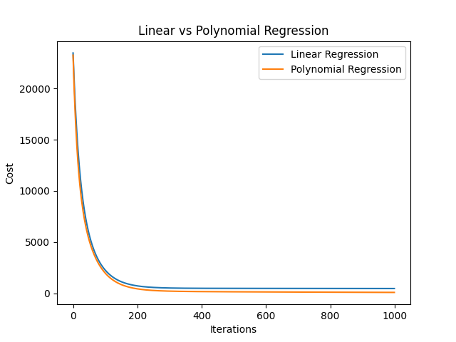
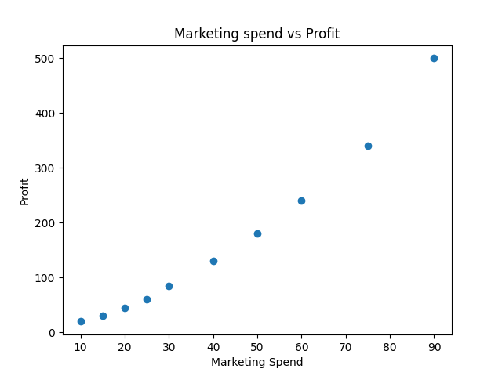
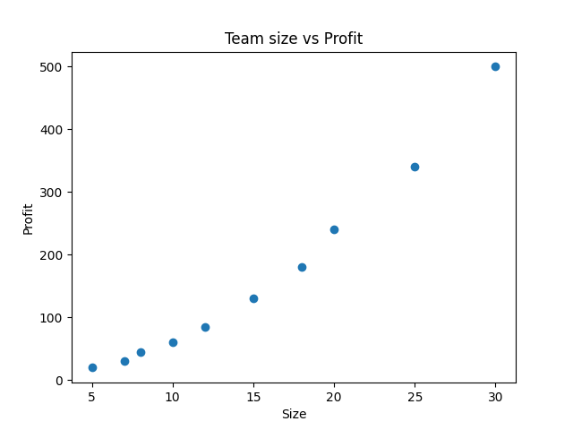
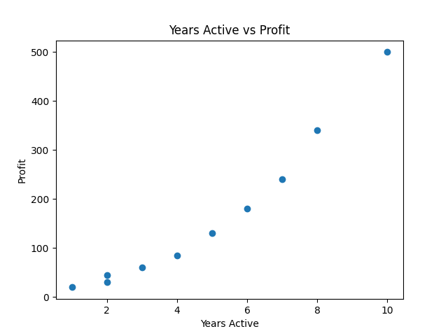

# Linear Regression vs Polynomial Regression

A machine learning project implementing Multiple Linear Regression and Polynomial Regression from scratch using NumPy.

## Project Overview

This project predicts startup profit using:

* Marketing Spend
* Team Size
* Years Active

The goal is to compare the performance of a standard Multiple Linear Regression model with a Polynomial Regression model created through feature engineering.

## Features Implemented

* Multiple Linear Regression
* Gradient Descent Optimization
* Z-Score Feature Scaling
* Cost Function Implementation
* Gradient Computationhttps://github.com/amriiit/Linear-Regression-vs-Polynomial-Regression/blob/main/README.md
* Feature Engineering
* Polynomial Regression
* Model Cost Comparison
* Data Visualization using Matplotlib

## Technologies Used

* Python
* NumPy
* Matplotlib

## Learning Outcomes

* Implemented regression algorithms from scratch
* Understood gradient descent mathematically and programmatically
* Learned feature scaling and normalization
* Applied feature engineering using polynomial features
* Compared linear and polynomial regression models
* Visualized model training and feature relationships

## Results

| Model                      | Final Cost |
| -------------------------- | ---------- |
| Multiple Linear Regression | 486.89     |
| Polynomial Regression      | 107.51     |

### Feature Comparison

| Model                 | Number of Features |
| --------------------- | ------------------ |
| Linear Regression     | 3                  |
| Polynomial Regression | 4                  |

### Observation

A polynomial feature (`Marketing Spend²`) was added through feature engineering.

The Polynomial Regression model achieved a final cost of **107.51** compared to **486.89** for the standard Multiple Linear Regression model.

This represents an improvement of approximately **77.9%**, showing that the engineered polynomial feature helped the model capture nonlinear relationships between marketing spend and startup profit more effectively.

## Visualizations

### Cost Comparison

This graph shows how the cost function decreases during training for both models. The Polynomial Regression model converges to a significantly lower cost than the Linear Regression model, indicating a better fit to the dataset.

### Marketing Spend vs Profit

This scatter plot visualizes the relationship between marketing expenditure and startup profit. A positive correlation can be observed, suggesting that higher marketing investments generally lead to increased profits.

### Team Size vs Profit

This graph illustrates how startup profit changes with team size. Larger teams tend to be associated with higher profits, although the relationship is not perfectly linear.

### Years Active vs Profit

This visualization shows the relationship between company age and profit. Startups that have operated for more years generally demonstrate higher profitability due to accumulated experience and market presence.
